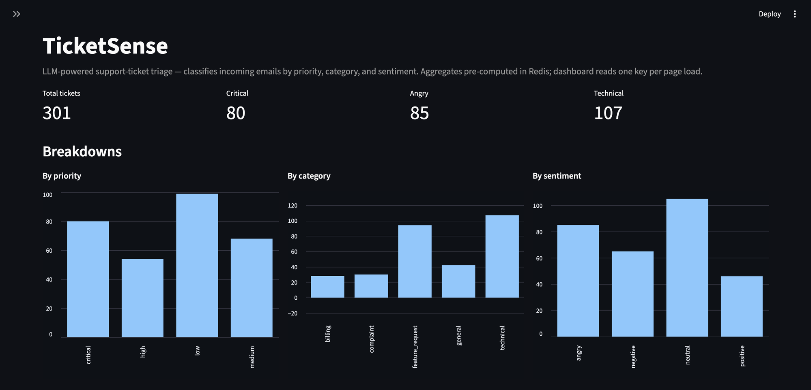

# TicketSense

> **An LLM-powered support ticket triage tool that classifies incoming emails by priority, category, and sentiment — then surfaces results in a real-time dashboard.**



Built with FastAPI-style layered architecture (DTOs / repositories / services), two storage tiers (Postgres for durable data, Redis for cached LLM results), production-grade LLM resilience (retry + model fallback), and a pre-computed overview pattern that scales the read path independently of dataset size.


## What it does

Customer-support teams receive hundreds of tickets daily — most routine, some critical, a few toxic. Reading every one to figure out which is which costs hours.

TicketSense reads incoming emails and labels them automatically along three dimensions:

- **Priority** — `low` / `medium` / `high` / `critical`
- **Category** — `billing` / `technical` / `feature_request` / `complaint` / `general`
- **Sentiment** — `positive` / `neutral` / `negative` / `angry`

Plus a one-sentence summary and 2–5 free-form tags per ticket.

A dashboard surfaces the aggregate (counts per dimension) and a random sample of triaged tickets so support managers can spot trends and high-priority items in seconds rather than minutes.


## Architecture

```
                                     ┌─────────────────────────────────┐
data/batch_{1-6}.json                │  Streamlit dashboard (:8501)    │
(300 synthetic seed tickets)         │  • 4 KPI cards                  │
              │                      │  • 3 breakdown charts           │
              │ scripts/load_seed    │  • 10-row random sample table   │
              ▼                      └────────────────┬────────────────┘
   ┌──────────────────────┐                           │
   │  Postgres (:5432)    │                           │ 1 Redis GET
   │  table: tickets      │                           ▼
   │  300 immutable rows  │           ┌──────────────────────────────┐
   └──────────┬───────────┘           │  Redis (:6379)               │
              │                       │                              │
              │ scripts/triage_all    │  triage:ticket:{id} × 300    │
              ▼                       │  (per-ticket TriageOutput,   │
   ┌──────────────────────┐           │   7-day TTL)                 │
   │  TriageService       │ writes →  │                              │
   │  • Primary: Llama 4  │           │  triage:overview             │
   │    Scout 17B MoE     │ ←  reads  │  (pre-computed aggregate,    │
   │  • Fallback: Llama   │   from    │   24-hour TTL)               │
   │    3.1 8B Instant    │           └──────────────────────────────┘
   │  • Retry + backoff   │
   └──────────┬───────────┘
              │
              ▼
   ┌──────────────────────┐
   │  Groq API (free tier)│
   │  Structured output   │
   │  via LangChain       │
   └──────────────────────┘
```

**Three layers, deliberately split by lifecycle:**

| Layer | Tool | What it stores | Lifecycle |
|---|---|---|---|
| **Durable data** | Postgres | Raw ticket rows | Forever — source of truth |
| **Cached analysis** | Redis (`triage:ticket:*`) | LLM-produced labels per ticket | 7-day TTL — regenerable if lost |
| **Read-optimized aggregate** | Redis (`triage:overview`) | Pre-computed counts for the dashboard | 24-hour TTL — refreshed after bulk triage |


## Tech stack

| Concern | Tool |
|---|---|
| Language | Python 3.14 |
| Validation / DTOs | Pydantic 2.x + pydantic-settings |
| ORM | SQLAlchemy 2.x (async) |
| Relational DB | Postgres 16 (Docker) |
| Cache | Redis 7 (Docker) |
| LLM | Groq (Llama 4 Scout primary, Llama 3.1 8B Instant fallback) |
| LLM framework | LangChain + langchain-groq |
| HTTP API | FastAPI + Uvicorn |
| Dashboard | Streamlit |
| Container orchestration | Docker Compose |

### Services & ports

| Service | Port | Where it runs | URL when running |
|---|---|---|---|
| **Postgres** | `5432` | Docker container (`triage_postgres`) | `postgresql://localhost:5432/triage` |
| **Redis** | `6379` | Docker container (`triage_redis`) | `redis://localhost:6379/0` |
| **FastAPI** | `8000` | Local Python process (Uvicorn) | http://localhost:8000 — docs at /docs |
| **Streamlit dashboard** | `8501` | Local Python process | http://localhost:8501 |

Two containers + two local processes. No conflicts; all four can run simultaneously.


## API Endpoints

| Method | Path | Purpose |
|---|---|---|
| `GET` | `/health` | Liveness probe — never touches DB / Redis |
| `GET` | `/overview` | Read the pre-computed dashboard aggregate (1 Redis GET) |
| `POST` | `/overview/refresh` | Recompute the aggregate from Postgres + Redis |
| `POST` | `/tickets` | Create a ticket (caller provides id + sender + timestamp) and auto-triage via LLM. Returns 409 if id exists. |
| `GET` | `/tickets?limit=20&offset=0` | Paginated ticket list with triages attached |
| `GET` | `/tickets/{ticket_id}` | Fetch one ticket with its triage |
| `POST` | `/tickets/{ticket_id}/triage` | Force re-triage (overrides cache) |

## Highlights

### Production-grade LLM resilience

Two layers of fault tolerance for every LLM call:

```
       Ticket → TriageService.triage(subject, body)
                            │
                            ▼
            ┌──────────────────────────────────────┐
            │  Primary: Llama 4 Scout (17B MoE)    │
            │  with structured_output(TriageOutput)│
            └────────────┬─────────────────────────┘
                         │
              ┌──────────┴──────────┐
              │                     │
        429 rate limit          success → return TriageOutput
              │
              ▼
       Retry: 1s → 2s → 4s
              │
              │ exhausted
              ▼
            ┌─────────────────────────────────┐
            │  Fallback: Llama 3.1 8B Instant │
            │  separate rate-limit pool       │
            └────────────┬────────────────────┘
                         │
                         │ same retry+success flow
                         ▼
                  Final TriageOutput
```

**Why two layers:**
- Retry-with-backoff handles transient 429s (most common failure, recoverable in seconds)
- Model-level fallback handles persistent issues with primary (different rate-limit pool, different infrastructure)

### Pre-computed overview for dashboard scalability

The dashboard's main query is **O(1)** regardless of dataset size:

```
Dashboard request
       │
       ▼
   GET triage:overview         ← 1 Redis call, ~0.5ms
       │
       ▼
   OverviewResponse(
     total_tickets=300,
     by_priority={...},
     by_category={...},
     by_sentiment={...},
   )
```

**Example `GET /overview` response** — the single key actually stored in Redis under `triage:overview`:

```json
{
  "total_tickets": 300,
  "by_priority": {
    "low": 99,
    "medium": 68,
    "high": 54,
    "critical": 79
  },
  "by_category": {
    "billing": 28,
    "technical": 106,
    "feature_request": 94,
    "complaint": 30,
    "general": 42
  },
  "by_sentiment": {
    "positive": 46,
    "neutral": 105,
    "negative": 65,
    "angry": 84
  }
}
```

### Constrained LLM output via Pydantic + Literal

The LLM cannot produce invalid values. The schema is enforced at the API layer:

```python
class TriageOutput(BaseModel):
    priority:  Literal["low", "medium", "high", "critical"]
    category:  Literal["billing", "technical", "feature_request", "complaint", "general"]
    sentiment: Literal["positive", "neutral", "negative", "angry"]
    summary:   str  # max 500 chars
    tags:      list[str]  # 2-5 kebab-case tags
```

**Example triage result** — what the LLM actually returns and what gets cached under `triage:ticket:{id}`:

```json
{
  "priority": "low",
  "category": "billing",
  "sentiment": "neutral",
  "summary": "The customer did not receive an email receipt for the April payment and needs it for expense reimbursement.",
  "tags": [
    "payment-receipt",
    "resend-request",
    "expense-reporting"
  ]
}
```

Combined with `LangChain.with_structured_output(TriageOutput)`, the LLM is structurally incapable of returning `"super high"` or `"medium-ish"`. Validated round-trip on both write (LLM → Redis) and read (Redis → dashboard).

### Layered architecture

```
Boundary contract  →  DTO          (Pydantic)
DB shape           →  ORM model    (SQLAlchemy)
Data access        →  Repository
Business logic     →  Service
Entry point        →  Script or Streamlit app
```

Each layer has a single concern. Swapping Streamlit for FastAPI, or Postgres for MySQL, or Groq for OpenAI, touches only one layer.

## Dataset

All 300 seed tickets in `data/batch_*.json` are **synthetic**:

1. **Initial generation** — ChatGPT (GPT-5.4) with per-batch theme prompts
2. **Quality rewrite** — Claude (Anthropic) hand-rewrote each ticket to fix templated outputs and ensure realistic edge cases (typos, all-caps rage, forwarded chains, MSA threats, etc.)
3. **Validation** — structurally verified: unique IDs/subjects/body openings, valid ISO 8601 timestamps, valid email format, 30 sender domains, ~150 unique sender names

No real customer data, no scraped data, no copied production records. See `data/README.md` for the full breakdown.
